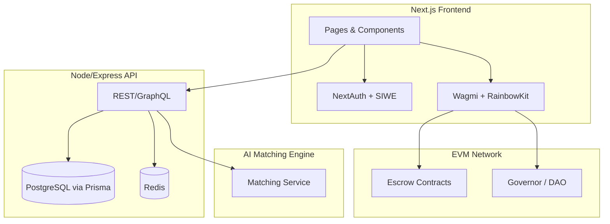

# SkillFi – Web3 Freelance Marketplace ✨

> A decentralized freelance marketplace built with Next.js, Solidity, and PostgreSQL.


SkillFi connects clients and Web3 talent with on-chain escrow, DAO‑based dispute resolution, and AI matching — secure, transparent, and community‑owned. 🚀


---

## Table of Contents

- [Why SkillFi?](#why-skillfi-realworld-problems-we-solve)
- [How it works](#how-it-works-at-a-glance)
- [Architecture](#architecture-high-level)
- [Flowchart](#flowchart-end-to-end-overview)
- [Features](#features)
- [Tech Stack](#tech-stack)
- [Quick Start](#quick-start)
- [Project Structure](#project-structure)
- [Smart Contracts](#smart-contracts)
- [API Endpoints](#api-endpoints)
- [Contributing](#contributing)
- [License](#license)

## Why SkillFi? (Real‑world problems we solve)

- **Trust & payment risk**: Funds are locked in smart‑contract escrow rather than a centralized custodian.
- **Opaque dispute resolution**: DAO‑based voting provides auditable, community‑owned outcomes.
- **Fragmented reputation**: Wallet‑tied identity with optional Web2 linking creates portable, verifiable reputation.
- **High platform fees, no voice**: Token holders govern fees, features, and rules on‑chain.
- **Poor matching**: AI matching suggests best client–freelancer fits to reduce search friction.

## How it works (at a glance)

- **On‑chain escrow and disputes**
  - UI: `frontend/components/dashboard/EscrowStatus.tsx`
  - DAO voting for disputes and proposals: `frontend/components/dashboard/GovernanceVoting.tsx`
  - Vote casting: `castVoteWithReason`, dispute voting via `voteOnDispute`
- **Governance & token mechanics**
  - Voting power: token delegation (`delegate`) and `getVotes` via `wagmi`/`viem`
  - Proposal state and tallies read from event logs + multicall
- **Job marketplace**
  - Listings UI: `frontend/components/dashboard/JobListings.tsx`
  - Milestones tied to escrow payouts
- **Auth & identity linking**
  - Wallet + Web2 (email/social) via NextAuth + SIWE, RainbowKit/Wagmi providers
- **AI matching**
  - Service scaffold: `ai-matching-engine/`

## Architecture (high-level)



## Similar to (but Web3‑native)

- **Upwork / Freelancer.com**: Marketplace workflow (jobs, proposals, milestones)
- **Braintrust / Gitcoin**: Tokenized incentives, on‑chain payouts, DAO governance
- **Aragon / OpenZeppelin Governor UIs**: Governance flows for proposals and voting

## Flowchart (end‑to‑end overview)

```mermaid
flowchart LR
  A[Client posts job] --> B{AI matching}
  B -->|suggests| C[Freelancers apply]
  C --> D[Client selects freelancer]
  D --> E[Escrow funded (smart contract)]
  E --> F[Work & milestones]
  F -->|deliverable accepted| G[Payout released]
  F -->|dispute| H[Dispute raised]
  H --> I[DAO vote (on-chain)]
  I -->|supports client| G
  I -->|supports freelancer| G
  G --> J[Reputation updated (on/off-chain)]
```

## Features

- 🔐 Web3 Authentication (MetaMask, WalletConnect)
- 💼 Project posting and bidding system
- 💰 Escrow smart contracts for secure payments
- 📊 Reputation system on-chain
- 🤖 AI-based talent matching
- 🔍 Advanced search and filtering
- 💬 Real-time messaging
- 📱 Responsive design with Tailwind CSS

## Tech Stack

- **Frontend**: Next.js 14, TypeScript, Tailwind CSS
- **Backend**: Node.js, Express, Prisma ORM
- **Database**: PostgreSQL
- **Blockchain**: Solidity, Hardhat, Ethers.js
- **Authentication**: NextAuth.js with Web3 providers

## Quick Start

1. **Install dependencies**
   ```bash
   npm install
   ```

2. **Setup environment variables**
   ```bash
   cp .env.example .env
   # Fill in your environment variables
   ```

3. **Setup database**
   ```bash
   cd backend && npx prisma migrate dev
   ```

4. **Compile smart contracts**
   ```bash
   npm run compile:contracts
   ```

5. **Start development servers**
   ```bash
   npm run dev
   ```

> Tip: Use two terminals for DX — one for the frontend and one for backend/contract tasks.

## Project Structure

```
SkillFi/
├── frontend/              # Next.js application (NextAuth, Wagmi/RainbowKit)
├── backend/               # Express API server (Prisma, Redis)
├── contracts/             # Solidity smart contracts (Hardhat)
├── ai-matching-engine/    # AI services for matching
├── database/              # Prisma schema, migrations, seeds
└── docs/                  # Additional docs
```

## Smart Contracts

- **SkillFiMarketplace**: Main marketplace contract
- **EscrowContract**: Handles secure payments
- **ReputationSystem**: On-chain reputation tracking

## API Endpoints

- `/api/auth/*` - Authentication
- `/api/projects/*` - Project management
- `/api/users/*` - User profiles
- `/api/contracts/*` - Smart contract interactions

## Contributing

We welcome contributions! 🙌

1. Fork the repository
2. Create a feature branch: `git checkout -b feat/awesome-thing`
3. Commit with conventional commits: `feat(ui): add settings sidebar`
4. Open a PR describing the change, screenshots, and tests

> Run `npm run lint` and `npm run typecheck` before pushing.

## License

MIT License
